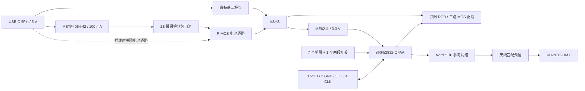

# nRF52832 Canon 遥控器：文字原理图 v0.1

日期：2026-09-17。用于转绘原理图和开始 PCB 规划；尚未完成 EDA ERC、PCB layout、射频调试或样机验证。

[查看 7 页图形原理图](schematic-drawing-v0.1.html)：2026-09-18 按本版连接绘制，含元件符号、引脚编号、数值和 layout 注释。本次补齐 BAT54H 的厂商脚号：2=阳极、1=阴极，电路拓扑不变。

本版对应目前的机械方案：四向圆环、中心 K2-1831SL-A4SW-01 两段键、下排三个圆键、NH-B1515RGBA-GF RGB、HX TYPE-C 6P QTWT 和单节软包锂电池。7 个普通开关 + 1 个两段开关，共 **9 路按键信号**。主控选 **nRF52832-QFAA，QFN48，6 × 6 mm**，不使用 WLCSP 的引脚表。

建议转绘为五页：① USB／充电／电源；② MCU／时钟；③ 按键／RGB；④ RF／天线；⑤ SWD／测试点。相同网络名直接相连。下文所有 `GND` 属于同一电气网络，`NC` 是不连接，`DNP` 是保留焊盘但首版不装。

## 1. 总体结构与电源网络



| 网络 | 含义／允许连接 |
| --- | --- |
| `VBUS_5V` | USB 输入；连接充电器、USB 电源通路和 USB 检测 MOS 的栅极电路 |
| `VBAT` | **电池保护板输出 P+**；满电约 4.2 V，不能直连 MCU VDD |
| `VSYS` | 切换后的系统电源；电池时接近 VBAT，USB 时约为 VBUS 减去二极管压降 |
| `VREG_3V3` | ME6211 输出，经过 R104 到 VDD |
| `VDD` | MCU／GPIO 电源，正常约 3.3 V；低电量时可能低于 3.3 V |
| `DEC1` / `DEC3` / `DEC4` | MCU 内部电源节点；仅连接指定无源件，不能给外部器件供电 |

USB 口用于供电和充电。该 6Pin 接口没有 USB 数据线；nRF52832 也没有原生 USB 控制器。

## 2. USB-C、充电与供电切换

### 2.1 J100：HX TYPE-C 6P QTWT

采用自购的 6Pin 全贴母座，对应 C18357553。[厂家图纸](../../reference/component-models/C18357553.pdf)与库封装一起复核，不使用之前 16Pin 型号的焊盘编号。

| J100 引脚／焊盘 | 连接 |
| --- | --- |
| A9、B9 | `VBUS_5V`，两脚都接 |
| A12、B12 | `GND`，两脚都接 |
| A5 / CC1 | `USB_CC1` |
| B5 / CC2 | `USB_CC2` |
| 金属壳焊脚（现有库编号 17～20） | `GND` |

```text
R100  5.1k  1% 0402 : USB_CC1 — GND          [C25905]
R101  5.1k  1% 0402 : USB_CC2 — GND          [C25905]
C100  100nF 16V 0402: VBUS_5V — GND         [C60474]
D101  PESDNC2FD5VB  : VBUS_5V — GND         [C5356109，双向 ESD]
D102  PESDNC2FD5VB  : USB_CC1 — GND         [C5356109，双向 ESD]
D103  PESDNC2FD5VB  : USB_CC2 — GND         [C5356109，双向 ESD]
```

CC1、CC2 **各自一个** 5.1 kΩ 下拉，不能短接后共用一个。D101～D103 用于 ESD，不构成持续过压保护。本版不做 PD 升压请求，按 5 V 电源使用，正常总耗电目标小于 150 mA。

**Layout 注释：** ESD 紧邻接口，接口引出的线先经过保护器件连接点再进入板内；ESD 地焊盘旁放就近地过孔。USB 金属壳焊盘提供机械固定与短的接地路径。板舌、焊耳与下盖开口继续沿用已确认的机械定位。不要在 USB 输入处随意增加大电容；后续检查插拔浪涌和 USB 输入电容量。

### 2.2 U100：MSTP4054-42，SOT23-5L

| 引脚 | 名称 | 连接 |
| --- | --- | --- |
| 1 | CHRG | `CHG_N` |
| 2 | GND | `GND` |
| 3 | BAT | `VBAT` |
| 4 | VCC | `VBUS_5V` |
| 5 | PROG | `CHG_PROG` |

```text
U100  MSTP4054-42                               [C49208527]
C101  2.2uF 6.3V 0603 : VBUS_5V — GND           [C5137560]
C102  1uF   16V  0603 : VBAT — GND              [C1592]
R105  10k 1% 0402     : CHG_PROG — GND          [C2906861]
R106  10k 1% 0402     : VDD — CHG_N             [C2906861]
CHG_N                : U100.1 — U200.21/P0.18
```

厂商给出的设置关系为 `I_CHG(A) = 1000 / R_PROG(Ω)`，所以 **10 kΩ → 100 mA**；针对当前 320 mAh 电池候选，约为 0.31C。若最终电池允许电流更小，换库存 12 kΩ 可降至约 83 mA，或进一步增大阻值。以最终电池手册的充电电流和温度范围为准。

该手册“功能描述”写充电终止为设定电流的 15%，另一段又写 PROG 低于 100 mV；两处不完全一致。首版按 100 mA 恒流设计，**实际终止电流须实测，不承诺固定 10 mA 或 15 mA**。`CHG_N=0` 表示正在充电；高电平也可能是没有 USB、未接电池或停充，须联合 `USB_PRESENT_N` 判断，不能单凭它显示“电池已充满”。[依据：MSTP4054-42 手册第 3～7 页](../../reference/electrical/MSTP4054-42.pdf)。

**电池接口 J101：** 两个焊线焊盘 `1=VBAT(P+)`、`2=GND(P−)`，旁边印 `+` / `−`，优先软线连接以节省高度。必须使用 **1S、4.2 V 充电、带过充／过放／短路保护**的软包电池。当前 LP402535 只是尺寸／容量候选，尚未确认购买版本是否带保护。若买裸电芯，必须增加保护电路后再使用本图的 J101。MSTP4054 本身不是电芯保护板，也没有电池 NTC 输入。

**Layout 注释：** C101 放 U100.4 旁，C102 放 U100.3 旁；PROG 电阻紧邻 U100.5，其地回到 U100.2 附近。充电电流路径留足线宽并铺地散热，远离晶体、天线和 ADC。100 mA、VBAT=3 V、VBUS=5 V 时芯片发热约 0.2 W；仍需装壳充电测温，不能用内部芯片热调节替代电池温度管理。

### 2.3 USB／电池自动切换

```text
D100  BAT54H，Nexperia，SOD123F，新增：
      2/A/阳极 = VBUS_5V
      1/K/阴极 = VSYS（器件标记条一侧）

Q100  AO3401A，P-MOS，SOT23，新增：
      1/G = BAT_PATH_GATE
      2/S = VSYS
      3/D = VBAT

R102  0Ω 0402  : VBUS_5V — BAT_PATH_GATE        [C2906858]
R103  10k 0402 : BAT_PATH_GATE — GND            [C2906861]
```

Q100 的 **D 接电池、S 接系统**，这是本电路的有意安排：体二极管方向为 `VBAT → VSYS`，USB 供电时阻止 VSYS 向电池直接灌电。插入 USB 后 Q100 关断，系统由 D100 供电，电池只通过 U100 充电；拔线后 R103 拉低栅极，Q100 导通，由电池供电。库存 SI2302 是 **N-MOS**，不能替代 Q100；库存 1N4148WS 也不是这里指定的肖特基。

D100 只承担系统负载，不经过 100 mA 充电电流；本版系统峰值按不超过约 30 mA 规划，BAT54H 的电流规格够用。其反向漏电会影响休眠，拔线及高温时实测。USB 电压下跌时电池可能经体二极管短暂补电，这不是完整的集成 power-path 控制器；检查插拔过程与 MCU 复位情况。[AO3401A](https://www.aosmd.com/pdfs/datasheet/AO3401A.pdf)、[BAT54H](https://assets.nexperia.com/documents/data-sheet/BAT54H.pdf)。

**Layout 注释：** D100、Q100 与 LDO 输入放在一起。VBAT 充电支路和系统支路在电池接口附近分开；不要让系统大电流从充电芯片 BAT 引脚焊盘上绕行。Q100 栅极不悬空，R103 靠近栅极。

### 2.4 U101：ME6211C33M5G-N，3.3 V LDO

| 引脚 | 名称 | 连接 |
| --- | --- | --- |
| 1 | VIN | `VSYS` |
| 2 | VSS | `GND` |
| 3 | CE | `VSYS`，常开 |
| 4 | NC | 不连接 |
| 5 | VOUT | `VREG_3V3` |

```text
U101  ME6211C33M5G-N                           [C82942]
C103  1uF 16V 0603 : VSYS — GND                [C1592]
C104  1uF 16V 0603 : VREG_3V3 — GND            [C1592]
R104  0Ω 0402     : VREG_3V3 — VDD             [C2906858]
```

R104 可拆下串入电流表测 MCU 电源支路；RGB 的电流来自 VSYS，整机电流应在电池入口另测。SWD 的 VDD 默认只作调试器电压参考，板子自行供电，避免调试器电源与 LDO 输出相互驱动。

ME6211 输入不能直接换成电池后再省掉稳压，因为 nRF52832 的 VDD 上限为 3.6 V，4.2 V 电池会超限。低电量时 LDO 进入压差区，VDD 不再保持 3.3 V，但仍可在 nRF52832 工作范围内运行；固件建议在约 3.2 V 电池电压时提示低电，约 3.0 V 时进入休眠，实际门限按电池与负载调试。

**待机取舍：** ME6211 首页标 40 µA 典型，C33 电气表标 60 µA 典型，首版功耗预算按较高的 60 µA。仅这一项已使 320 mAh 电池的理想时间约为 222 天，尚未扣除其他负载、自放电和不可用容量；不能据此宣称多年续航。若目标是很长的闲置时间，下一版优先换低静态电流 LDO。[ME6211 手册，第 4、8 页](../../reference/electrical/ME6211.pdf)。

**Layout 注释：** C103 靠 VIN/GND、C104 靠 VOUT/GND，回路短，输出电容不能省略。R104 位于 C104 后；MCU 本地去耦位于 R104 的 VDD 侧。1 µF 的实际有效容量需要考虑 MLCC 直流偏压，不只看标称值。

### 2.5 USB 检测与电池测量

```text
Q101  SI2302，N-MOS SOT23 [C2891732]：
      1/G = USB_GATE ; 2/S = GND ; 3/D = USB_PRESENT_N
R107  10k 0402 : VBUS_5V — USB_GATE             [C2906861]
R108  1M  0603 : USB_GATE — GND                [C49196763]
R109  10k 0402 : VDD — USB_PRESENT_N            [C2906861]
USB_PRESENT_N : U200.22/P0.19；有 USB 时为低

R110  1M 1% 0603 : VBAT — VBAT_SENSE           [C49196763]
R111  1M 1% 0603 : VBAT_SENSE — GND            [C49196763]
C105  100nF 0402 : VBAT_SENSE — GND            [C60474]
VBAT_SENSE      : U200.4/P0.02/AIN0
```

USB 检测经 MOS 隔离电压，**VBUS 不直接进入 GPIO**。电池分压比为 1/2，满电 ADC 输入约 2.1 V；分压常耗约 2.1 µA。SAADC 使用内部 0.6 V 参考、增益 1/6、单端、采集时间 40 µs，关闭该脚数字输入缓冲与上下拉。等效源阻约 500 kΩ；40 µs 对应的 Nordic 最大源阻为 800 kΩ。C105 的 RC 时间常数约 50 ms，上电至少等约 250 ms 再读，平时低频采样，勿连续高速采样。[SAADC 依据](https://docs.nordicsemi.com/r/bundle/ps_nrf52832/page/saadc.html)。

**Layout 注释：** R110/R111/C105 靠 ADC 输入，避开 RF、DCC 和 LED PWM 走线。R104 拆开、MCU 未供电时，VBAT_SENSE 仍可能通过输入保护结构产生微小反灌；调试外部供电前先断开电池，不能把 R104 当作全机电气隔离开关。

## 3. nRF52832 主控最小系统

U200 使用 nRF52832-QFAA。以下接线以 Nordic QFAx 参考设计 v1.1 为基础；原版 [参考原理图](../../reference/electrical/nrf52832_qfaa_dcdc_schematic.pdf)和 [参考 PCB](../../reference/electrical/nrf52832_qfaa_dcdc_pcb.pdf)已归档。电源和 RF 区尽量保留其相对布局。

### 3.1 电源、内部稳压及复位

```text
U200.13/VDD = VDD     C203 100nF 0402 : VDD — GND，靠 pin 13 [C60474]
U200.36/VDD = VDD     C204 100nF 0402 : VDD — GND，靠 pin 36 [C60474]
U200.48/VDD = VDD     C205 4.7uF 0402 : VDD — GND，靠 pin 48 [C46635918]
                      C206 100nF 0402 : VDD — GND，靠 pin 48 [C60474]

U200.31/VSS = GND
U200.45/VSS = GND
U200.EP     = GND     裸露中心焊盘必须接地，不得悬空

U200.1/DEC1 = DEC1    C200 100nF 0402 : DEC1 — GND [C60474]
U200.32/DEC2 = NC     本 QFN48 版本不装 DEC2 电容，不接 VDD/GND
U200.33/DEC3 = DEC3   C201 100pF C0G 0402 : DEC3 — GND [C46614473]
U200.46/DEC4 = DEC4   C202 1uF 0603 : DEC4 — GND [C1592]
U200.44/NC = NC

U200.47/DCC — L200(10uH) — DCDC_MID — L201(15nH) — DEC4
L200 = TDK MLZ1608M100WT000，0603，新增
L201 = SDCL1005C15NKTDF，0402，库存 C370189

U200.24/P0.21/nRESET = RESET_N
R200 10k 0402 : VDD — RESET_N [C2906861]
TP205 = RESET_N，单独测试焊盘

U200.37/P0.25 — C218(12pF C0G 0402) — GND [C45359894]
U200.38/P0.26 — C219(12pF C0G 0402) — GND [C45359894]
```

C218/C219 沿用 v1.1 参考图对 errata 138 的处理，这两脚本版不分配其他功能。不要把 **GPIO P0.25/P0.26** 与 **封装 pin 25/26（SWD）** 混淆。[Nordic PCB 指南](https://devzone.nordicsemi.com/guides/hardware-design-test-and-measuring/b/nrf5x/posts/nrf52832-specific-pcb-guidelines)。复位功能需要固件正确配置 `UICR.PSELRESET`。

**DC/DC 选件：** Nordic 要求 10 µH 电感额定电流至少 50 mA；库存 C411950 / SCL1608S100KSP 的规格只有 3 mA，不采用。L200 选用额定电感变化电流 90 mA 的 [TDK MLZ1608M100WT000](https://product.tdk.com/en/search/inductor/inductor/smd/info?part_no=MLZ1608M100WT000)。装好 L200/L201 后固件开启 DC/DC。若先用内部 LDO 调试，两颗电感均 DNP、DCC 悬空，C202 保留，并保持 `DCDCEN=0`；不要把 DCC 短接到 VDD。

库存去耦有两处与参考 BOM 不同：C205 为 0402/±20%，Nordic 原版是 0603/±10%；C202 库存为 X5R，原版为 X7R。首版可以先按上述库存画图，但采购／投板前核对有效容量、温度范围及封装，必要时换回参考规格；**不能仅因容量字样相同就认为完全等效**。

**Layout 注释：**

- C200、C201、C202 分别紧邻对应 DEC 脚，电容到芯片的线短，电容接地就近落过孔；不要把三个 DEC 网络连接在一起。
- C203/C204 不共享一条长去耦支线。电源先到对应电容连接点，再到 VDD 脚；参考布局优先于机械式套用“必须某个方向进线”。
- L200/L201/C202 形成紧凑回路，DCC 开关节点不铺大铜、不绕到晶体或天线下面。10 µH → 15 nH 的顺序保持参考电路。
- 裸露焊盘与 GND 平面可靠连接，使用适量接地过孔并按装配能力处理阻焊／塞孔，避免焊锡被过孔吸走。
- C218/C219 紧邻 pin 37/38，不延长到板外测试点。

### 3.2 32 MHz 与 32.768 kHz 时钟

```text
X200 = YE32MDBCD2X，32MHz，CL=10pF，2016-4P [C54427949]
X200.1 — U200.34/XC1
X200.3 — U200.35/XC2
X200.2、X200.4 — GND

C210 12pF  C0G 0402 : XC1 — GND [C45359894]
C211 2.4pF C0G 0402 : XC1 — GND [C45359903]
C212 12pF  C0G 0402 : XC2 — GND [C45359894]
C213 2.4pF C0G 0402 : XC2 — GND [C45359903]
每侧合计 14.4pF，初调值，需校准；不是两个电容串联。

X201 = KFC3276812520T，32.768kHz，CL=12.5pF，3215-2P [C18209174]
X201.1 — U200.2/P0.00/XL1
X201.2 — U200.3/P0.01/XL2

C214、C215 各10pF C0G 0402 : XL1 — GND [C32949]，并联共20pF
C216、C217 各10pF C0G 0402 : XL2 — GND [C32949]，并联共20pF
```

这里为优先使用库存而采用并联凑值；量产可合并成每侧一颗经过验证的负载电容。**CL 是晶体要求的等效负载，不是两颗对地电容各自的数值。** 对称布局可近似写为 `CL ≈ Cext/2 + Cpar,eff`，其中寄生项已包含两个 MCU 引脚电容折算与 PCB 寄生，不能重复计算。Nordic 给出的引脚电容典型约 4 pF/脚。

本版高频 14.4 pF/侧对应暂估 `Cpar,eff=2.8 pF`，低频 20 pF/侧对应暂估 `2.5 pF`；这些是布局前估计，须用实板频率／起振检查修正。不能照搬 Nordic 原图两侧 12 pF：原图晶体 CL 为 8 pF／9 pF，而库存是 10 pF／12.5 pF。[Nordic 时钟规格](https://docs.nordicsemi.com/r/bundle/ps_nrf52832/page/clock.html)、[X200 手册](../../reference/electrical/YE32MDBCD2X.pdf)、[X201 手册](../../reference/electrical/KFC3276812520T.pdf)。

X200 的库存条目指定 10 pF，所附厂商 PDF 是系列通用表；其 1/3 晶体端、2/4 接地的引脚图已核对。量产前锁定完整订购参数，检查初始误差、温漂、老化及电容拉偏的总误差满足 BLE ±40 ppm。X201 的 ±20 ppm 是室温初始值，固件 LFCLK 精度配置须包含工作温度漂移，不能直接填 20 ppm。

**Layout 注释：** 晶体和负载电容紧贴对应引脚，同层、短线、少过孔，晶体回路下不走 DCC/PWM/SWD 等信号。接地环与地平面按 Nordic 参考布局组织，避免新增大寄生。不要在晶体线上放长支路测试点，也不要直接用普通高电容示波器探头判断其工作频率；采用时钟输出或射频频偏测试。

## 4. 按键

全部采用独立 GPIO 输入，低电平有效，使用 MCU 内部上拉；可配置 GPIO SENSE 唤醒。没有矩阵扫描，中心两段可以独立检测。

每路通用接法如下，`KEY_*` 为 MCU 侧，`SW_*` 为开关侧：

```text
U200.GPIO ── KEY_* ── R30x(1k) ── SW_* ── 开关触点 ── GND
               │
             C30x(1nF)
               │
              GND
```

R300～R308 全部 1 kΩ 0402（C106235），C300～C308 全部 1 nF 0402（C22435949）。这里的 RC 用于抑制尖峰和高频干扰；**仍需固件约 5～15 ms 去抖**，不是硬件长时间去抖。

| 开关／触点 | 功能 | 开关侧网络 | MCU 侧网络 | GPIO／QFN 脚 | 串阻／电容 |
| --- | --- | --- | --- | --- | --- |
| S300 | 圆环上 | SW_UP | KEY_UP | P0.04 / 6 | R300 / C300 |
| S301 | 圆环下 | SW_DOWN | KEY_DOWN | P0.05 / 7 | R301 / C301 |
| S302 | 圆环左 | SW_LEFT | KEY_LEFT | P0.06 / 8 | R302 / C302 |
| S303 | 圆环右 | SW_RIGHT | KEY_RIGHT | P0.07 / 9 | R303 / C303 |
| S304 | 下排左圆键 | SW_AUX1 | KEY_AUX1 | P0.08 / 10 | R304 / C304 |
| S305 | 下排中圆键 | SW_AUX2 | KEY_AUX2 | P0.11 / 14 | R305 / C305 |
| S306 | 下排右圆键 | SW_AUX3 | KEY_AUX3 | P0.12 / 15 | R306 / C306 |
| S307.a / SW1 | 中心半按 | SW_HALF | KEY_HALF | P0.16 / 19 | R307 / C307 |
| S307.b / SW2 | 中心全按 | SW_FULL | KEY_FULL | P0.17 / 20 | R308 / C308 |

S300～S306 为 TS-1101-C-W（C318938），两电气端分别接对应 `SW_*` 与 GND。S307 是 **一颗 K2-1831SL-A4SW-01**，不是两颗普通开关：

```text
S307 的 c 公共端（两个 c 焊脚） → GND
S307 的 a / 第一段触点         → SW_HALF
S307 的 b / 第二段触点         → SW_FULL
两个定位孔                    → NPTH，无电气连接
```

按 [HRO 图纸](../review/k2-1831sl-datasheet.pdf) 的 `a/b/c` 标识建符号；若库符号使用数字脚号，须明确填写数字与字母对应，不按普通四脚轻触的“两两短接”方式猜测。预计半按第一段闭合、全按两段闭合；用实物通断测试确认时序后再确定固件事件处理。板上 a/b 的方向以厂家焊盘视图为准，注意与顶视图的镜像关系。

**Layout 注释：** 开关首先服从键帽顶柱和中心开关定位孔的机械位置。串阻和小电容靠 MCU；开关长线与 RF 馈线保持距离，并保证连续地参考。不要让开关回地跨过晶体或 RF 的局部接地区。按键持续按住时内部上拉会耗电，休眠策略需处理被压住的按键。

## 5. RGB LED：NH-B1515RGBA-GF

D400 选库存 C52212029。厂家引脚为 **2 共阳、1 红阴极、3 蓝阴极、4 绿阴极**，不是按 R/G/B 顺序依次编号。[引脚依据：手册第 6 页](../../reference/electrical/NH-B1515RGBA-GF.pdf)。

RGB 共阳接 VSYS，三个通道由库存 SI2302 低边驱动。这样 GPIO 只驱动栅极，不直接承受 VSYS，绿色／蓝色也比直接挂 3.3 V 有更多电压余量。

```text
D400.2/共阳 = VSYS
C400 100nF 16V 0402 : VSYS — GND [C60474]

D400.1/R阴极 — R400(1.2k 0402, C2909307) — Q400.3/D
D400.4/G阴极 — R401(1k   0402, C106235)   — Q401.3/D
D400.3/B阴极 — R402(1k   0402, C106235)   — Q402.3/D

Q400、Q401、Q402 = SI2302 / C2891732，均 2/S → GND

U200.16/P0.13/LED_R_PWM — R403(1k) — Q400.1/G
U200.17/P0.14/LED_G_PWM — R404(1k) — Q401.1/G
U200.18/P0.15/LED_B_PWM — R405(1k) — Q402.1/G
R403～R405 = 1k 0402 / C106235

R406(1M) : Q400.1/G — GND
R407(1M) : Q401.1/G — GND
R408(1M) : Q402.1/G — GND
R406～R408 = 1M 0603 / C49196763
```

GPIO 高电平点亮。每个颜色独立限流，不共用一个限流电阻。按红色 Vf≈2.0 V、绿蓝≈3.0 V 粗估：4.2 V 电池下约 1.8 mA／1.2 mA／1.2 mA；VSYS≈4.7 V 时约 2.3 mA／1.7 mA／1.7 mA。这是亮度初值，不是恒流驱动；低电量时绿蓝可能变暗，需配合导光件实测混色和 PWM 占空比。考虑电阻误差及 LED Vf，USB 最高电压下仍需复核电流。

**Layout 注释：** D400 按导光件位置固定，C400 贴近 LED 共阳供电处；MOS、限流电阻放 LED 附近。MOS 栅极下拉避免上电闪亮；PWM 走线避开天线与晶体，回流留在 LED 驱动区域，不能穿过 ANT 匹配电容的接地回路。初期用几百 Hz 至约 1 kHz PWM，空闲关闭。

## 6. RF 与陶瓷天线

ANT200 使用库存 **KH-2012-HM1 / C2925419**。厂商定义 **pin 1=INPUT，pin 2=NC**；第二焊盘仅按图纸机械焊接，不接地、不连接到其他网络。

```text
                         L220 3.9nH
U200.30/ANT ── RF_ANT ─────LLLL───── RF_50 ── R221(0Ω) ── ANT_FEED ── ANT200.1
                  │                   │                      │
              C220 0.8pF          C221 DNP               C222 DNP
                  │                   │                      │
                 GND                 GND                    GND

ANT200.2 = NC
```

| 位号 | 本版值／封装 | 来源／作用 |
| --- | --- | --- |
| C220 | 0.8 pF，C0G/NP0，0402，精度按参考要求选 | 新增，**位于 MCU ANT 侧**，不是电感远端 |
| L220 | 3.9 nH，高 Q 射频电感，0402，±5% | 新增；库存 3.0 nH 不直接替换 |
| C221、C222 | DNP，0402，预留 C0G 电容或高频电感 | 天线调谐并联臂，数值 TBD |
| R221 | 0 Ω 0402 | 库存 C2906858；调谐时可替换为串联电感／电容 |
| ANT200 | KH-2012-HM1，2.0 × 1.2 × 0.5 mm | 库存 C2925419 |

**分清两个网络：** C220/L220 是 Nordic QFN48 的参考射频网络，本版先保留参考初值；C221/R221/C222 才是陶瓷天线的匹配预留，按你的要求暂不计算。厂商天线示例板为 90 × 50 mm，不能把它的 1.5 pF／0.7 pF 数值当作本遥控器最终匹配；库存这两种值可留作调试备料。[Nordic 参考电路](https://docs.nordicsemi.com/r/bundle/ps_nrf52832/page/ref_circuitry.html)、[天线手册第 2～3 页](../../reference/electrical/KH-2012-HM1.pdf)。

**Layout 注释：**

- C220/L220 与 U200 的相对位置、接地方式尽量照参考 PCB；ANT → C220 → L220 这段不是可以随意拉长的 50 Ω 线。C220 地端紧靠 U200.31/VSS 与中心接地，采用短、低电感回路。
- 从 `RF_50` 开始到天线匹配区，按实际板厚／叠层计算 50 Ω 馈线；不要先指定一个通用线宽。地参考连续，不跨分割或开槽，旁边地过孔围栏不能侵入天线净空。
- 天线朝板边放置，按厂家第 2 页的焊盘、馈入方向和地开窗复刻其局部布局。该图含毫米级地开窗（约 5 × 4 mm 量级），不是仅给 2 × 1.2 mm 器件本体留空。最终 keepout 尺寸需在 PCB 图中按厂家坐标明确标注。
- 天线辐射净空区各层不铺铜、不走线，只有厂家规定的馈线／焊盘结构；馈线区则需要参考地，两者不要混淆。NC 焊盘保持孤立。
- 天线远离软包电池铝膜、USB 壳、SWD 排针、螺丝以及金属开关。当前 3D 模型尚未安放本版天线和全部电源器件，必须重新做实体位置检查；机械 PCB 外形不等于已完成 RF 布局。
- 实板装上电池、外壳、导光件，并考虑手握状态后再调天线。匹配区留可拆串联位 R221，便于断开 MCU 做测量；不要无故增加长支路 SMA 测试线。

## 7. J200：4Pin SWD

**单排 1×4，2.54 mm，固定顺序如下：**

| 连接器脚号 | 丝印 | 网络／连接 |
| --- | --- | --- |
| 1 | VDD | `VDD`，调试电压参考 |
| 2 | GND | `GND` |
| 3 | IO | `SWDIO` → U200.26/SWDIO |
| 4 | CLK | `SWDCLK` → U200.25/SWDCLK |

第一版直接连接，不在 CLK/IO 上加大电容。调试器启用目标电压检测，板子由电池或 USB 正常供电；**不向 pin 1 施加 5 V**。RESET_N 留独立 TP205，四针顺序不变。

**Layout 注释：** pin 1 用方焊盘和三角标记，丝印直接标 `1:V / 2:G / 3:IO / 4:CK`。排针只装调试样机，日常版本可空焊盘配探针，避免高度干涉；这个 2.54 mm 接口尚未反映在当前外壳模型中。SWD 走线短、带地参考，远离天线净空与晶体。

测试点建议：TP200=VDD，TP201=GND，TP202=VBUS_5V，TP203=VBAT，TP204=VSYS，TP205=RESET_N，TP206=CHG_N，TP207=USB_PRESENT_N。不要在 DEC／晶体／ANT 节点新增长测试支线。

## 8. U200 完整引脚分配表

| QFN 脚 | 芯片功能 | 本版连接 |
| --- | --- | --- |
| 1 | DEC1 | DEC1，C200 到地 |
| 2 | P0.00/XL1 | X201.1，C214/C215 到地 |
| 3 | P0.01/XL2 | X201.2，C216/C217 到地 |
| 4 | P0.02/AIN0 | VBAT_SENSE |
| 5 | P0.03/AIN1 | NC，备用 |
| 6 | P0.04 | KEY_UP |
| 7 | P0.05 | KEY_DOWN |
| 8 | P0.06 | KEY_LEFT |
| 9 | P0.07 | KEY_RIGHT |
| 10 | P0.08 | KEY_AUX1 |
| 11 | P0.09/NFC1 | NC，保留默认 NFC 配置 |
| 12 | P0.10/NFC2 | NC，保留默认 NFC 配置 |
| 13 | VDD | VDD，C203 |
| 14 | P0.11 | KEY_AUX2 |
| 15 | P0.12 | KEY_AUX3 |
| 16 | P0.13 | LED_R_PWM，经 R403 |
| 17 | P0.14 | LED_G_PWM，经 R404 |
| 18 | P0.15 | LED_B_PWM，经 R405 |
| 19 | P0.16 | KEY_HALF |
| 20 | P0.17 | KEY_FULL |
| 21 | P0.18 | CHG_N |
| 22 | P0.19 | USB_PRESENT_N |
| 23 | P0.20 | NC，备用 |
| 24 | P0.21/nRESET | RESET_N |
| 25 | SWDCLK | J200.4 |
| 26 | SWDIO | J200.3 |
| 27 | P0.22 | NC，备用 |
| 28 | P0.23 | NC，备用 |
| 29 | P0.24 | NC，备用 |
| 30 | ANT | RF_ANT |
| 31 | VSS | GND |
| 32 | DEC2 | NC，QFN 不装去耦 |
| 33 | DEC3 | DEC3，C201 到地 |
| 34 | XC1 | X200.1，C210/C211 到地 |
| 35 | XC2 | X200.3，C212/C213 到地 |
| 36 | VDD | VDD，C204 |
| 37 | P0.25 | C218 12 pF 到地，无其他负载 |
| 38 | P0.26 | C219 12 pF 到地，无其他负载 |
| 39 | P0.27 | NC，备用 |
| 40 | P0.28/AIN4 | NC，备用 |
| 41 | P0.29/AIN5 | NC，备用 |
| 42 | P0.30/AIN6 | NC，备用 |
| 43 | P0.31/AIN7 | NC，备用 |
| 44 | NC | 不连接 |
| 45 | VSS | GND |
| 46 | DEC4 | DEC4，C202 和 L201 |
| 47 | DCC | L200 输入 |
| 48 | VDD | VDD，C205/C206 |
| EP | 裸露中心焊盘 | GND；若库编号 49，核实其确为 EP |

未使用 GPIO 保持输入断开、无上拉／下拉，不输出快速信号。尤其靠 RF 一侧的空闲 GPIO 不随意改成高速接口。[引脚依据](https://docs.nordicsemi.com/r/bundle/ps_nrf52832/page/pin.html)。

## 9. 首版 BOM 与库存对应

按所属电路、具体作用和已有／待采购状态拆分的完整表格见 **[完整电气 BOM v0.1](BOM-v0.1.md)**。下面保留按料号合并的单板用量汇总。

下表数量是单板默认装配数，包含并联晶体电容，不含 DNP 和测试焊盘。原始订单是购入记录，实际剩余库存仍以实物为准。

| 物料号／来源 | 规格 | 数量 | 位号 |
| --- | --- | ---: | --- |
| 新增 | nRF52832-QFAA | 1 | U200 |
| C49208527 | MSTP4054-42 | 1 | U100 |
| C82942 | ME6211C33M5G-N | 1 | U101 |
| 淘宝自购；C18357553 对应型号 | HX TYPE-C 6P QTWT | 1 | J100 |
| 新增／选定实物 | 1S 带保护软包，候选 320 mAh | 1 | J101 外接电池 |
| 新增 | 1×4 2.54 mm SWD 排针／焊盘 | 1 | J200 |
| 新增 | AO3401A / P-MOS / SOT23 | 1 | Q100 |
| 新增 | Nexperia BAT54H / SOD123F | 1 | D100 |
| C2891732 | SI2302 / N-MOS / SOT23 | 4 | Q101、Q400～Q402 |
| C5356109 | PESDNC2FD5VB / DFN1006-2 | 3 | D101～D103 |
| C54427949 | 32 MHz / YE32MDBCD2X | 1 | X200 |
| C18209174 | 32.768 kHz / KFC3276812520T | 1 | X201 |
| 新增 | 10 µH / MLZ1608M100WT000 / 0603 | 1 | L200 |
| C370189 | 15 nH / SDCL1005C15NKTDF / 0402 | 1 | L201 |
| 新增 | 3.9 nH RF，±5%，0402 | 1 | L220 |
| 新增 | 0.8 pF C0G，0402，精度按 Nordic 要求 | 1 | C220 |
| C2925419 | KH-2012-HM1 天线 | 1 | ANT200 |
| C318938 | TS-1101-C-W | 7 | S300～S306 |
| 手工记录 | K2-1831SL-A4SW-01 | 1 | S307 |
| C52212029 | NH-B1515RGBA-GF | 1 | D400 |
| C25905 | 5.1 kΩ 1% 0402 | 2 | R100、R101 |
| C2906858 | 0 Ω 0402 | 3 | R102、R104、R221 |
| C2906861 | 10 kΩ 1% 0402 | 6 | R103、R105、R106、R107、R109、R200 |
| C49196763 | 1 MΩ 1% 0603 | 6 | R108、R110、R111、R406～R408 |
| C106235 | 1 kΩ 1% 0402 | 14 | R300～R308、R401～R405 |
| C2909307 | 1.2 kΩ 1% 0402 | 1 | R400 |
| C60474 | 100 nF 16 V X7R 0402 | 7 | C100、C105、C200、C203、C204、C206、C400 |
| C5137560 | 2.2 µF 6.3 V 0603 | 1 | C101 |
| C1592 | 1 µF 16 V 0603 | 4 | C102、C103、C104、C202 |
| C46635918 | 4.7 µF 10 V 0402；核对偏压，必要时换参考 0603 | 1 | C205 |
| C46614473 | 100 pF C0G 0402 | 1 | C201 |
| C45359894 | 12 pF C0G 0402 | 4 | C210、C212、C218、C219 |
| C45359903 | 2.4 pF C0G 0402 | 2 | C211、C213 |
| C32949 | 10 pF C0G 0402 | 4 | C214～C217 |
| C22435949 | 1 nF 25 V 0402 | 9 | C300～C308 |
| DNP／待调 | 天线并联匹配 0402 | 0（留 2 位） | C221、C222 |

**明确不直接替换：** C411950 的 10 µH 电感、C52109822 的 3.0 nH 电感、C48986284 的 0.7 pF 电容分别不能直接视为这里的 10 µH 电源电感、3.9 nH RF 电感、0.8 pF RF 电容。0.7 pF 与 1.5 pF 库存留作天线调谐。

## 10. 转绘及首次调试顺序

1. 先按引脚表建原理图，核对 LED、USB、两段开关、Q100 源漏、陶瓷天线 NC 和 QFN 中心地焊盘。跑 EDA ERC；本文件不是已通过 ERC 的工程文件。
2. 锁定实际电池保护方式；复核 C205/C202 的有效容量、最终晶体订购参数以及新增射频物料。匹配值 TBD 不妨碍先画预留网络，但不能据此保证射频性能。
3. 先不接电池，用限流 5 V 检查 VBUS→VSYS→VDD，确认 VDD 不超过 3.6 V；再分别验证电池供电、USB 插拔和充电电流／终止。充电和系统供电是两个支路。
4. SWD 识别芯片、验证 LF/HF 时钟和半按／全按触点。先关闭 RGB 测休眠电流，再逐色测电流与导光效果；确认 DC/DC 装配配置与固件一致。
5. 布局完成后，按实际叠层处理 RF 50 Ω、复制芯片参考局部布局、按天线手册落实净空；装壳后做频偏、匹配与通信距离验证。

本版覆盖硬件接口，不包含 Canon BR-E1 配对／BLE 指令实现；硬件具备 BLE 能力不等于已验证与相机兼容。资料来源和已归档手册见 [reference/electrical/README.md](../../reference/electrical/README.md)。
