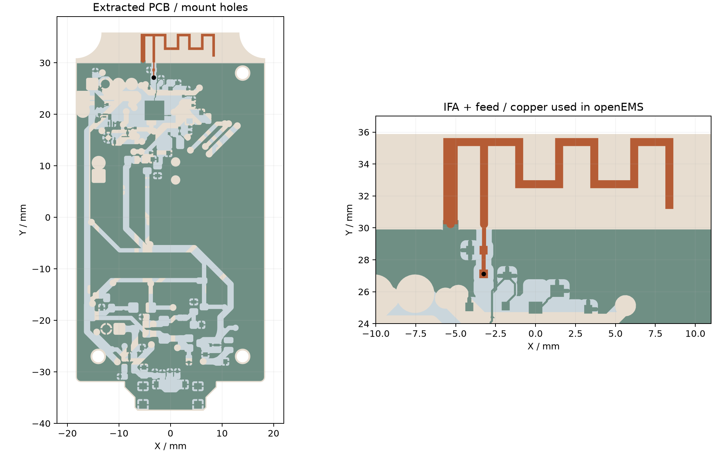
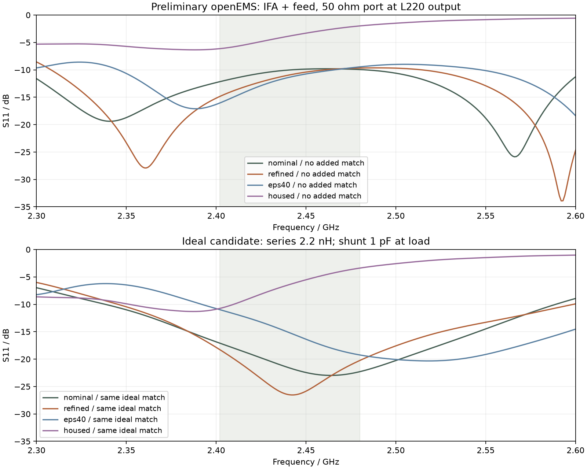
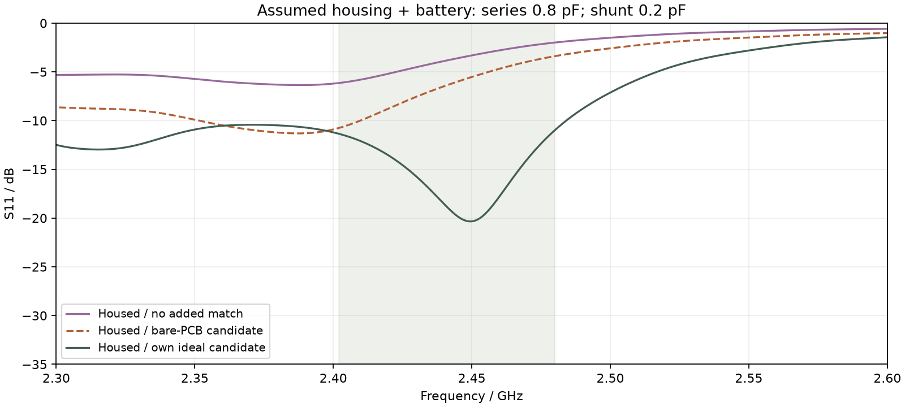

# 天线阻抗与匹配：openEMS 初步计算

2026-09-23 · 基于 Chrome 中的 PCB 定稿读取位置和地铜。已实际完成四次 openEMS 求解，输出阻抗、S 参数与理想元件网络的计算结果。

**结论：裸板可以得到一个初步匹配候选，但现在不能据此确定最终装机的匹配 BOM。** 模型中的天线已是 PCB 印制 IFA，名称为 `ANT_PCB_2.4G_FLIP`，不是早期物料表中的陶瓷天线。加入假设的外壳和电池后，阻抗发生明显变化，必须结合最终材料、装配和实测再定值。

> 本次没有修改嘉立创EDA的原理图或 PCB layout。下面的元件值是指定参考面上的计算候选，不是直接替换现板 C216 / L220 / C217 的指令。

## 1. 几何依据和本轮模型更新

上方 Ø2.3 mm 安装孔从 `(0, 28)` 移至 **`(14, 28) mm`**；两个下方孔仍为 `(-14, -27)`、`(14, -27) mm`。坐标以 PCB 正面视图为准，X 向右、Y 向上。上下盖螺柱、螺钉通道与 PCB 同步更新。

当前 EDA 叠层约为 **1.0 mm**。机械模型按此厚度调整，保持按键面高度，底面 USB-C 与托台随板底面一起上移 0.6 mm。若实际下单板厚不同，需要一起修改机械和 RF 模型。USB-C 十个焊盘已用当前 PCB 坐标核对，最大位置误差小于 0.004 mm；同时修正库模型相对封装原点的偏移。

[查看 v0.11 外壳与 PCB 3D 模型](../preview.html?rev=3cba5af) · [下载模型](../models/remote_assembly.3mf)

RF 提取范围：当前两面 GND 铺铜、GND 焊盘与走线、46 个 GND 过孔、板框和三个安装孔、天线和天线侧馈线。下图是仿真使用的几何；底层也以正面 XY 坐标绘出。深绿色为底层地铜，浅蓝色为顶层地铜，棕色为 IFA 与馈线，黑点为端口。



**天线铜形状的限制：** 当前 API 未返回封装内部铜图元，采用 2026-09-22 导出的同 UUID 封装，并与 2026-09-23 当前 PCB 的 FEED / GND 两个焊盘核对位置，误差小于 0.004 mm。未能完成最终 Gerber 的再次导出核验，因此不能把该模型称为已完整核验的制造版几何。当前完整 PCB 快照仅保留本地，公开的提取几何及来源 SHA-256 足以复算此研究。

## 2. 端口在哪里，计算了什么

50 Ω 集总端口放在 **L220 的天线侧焊盘，网络 `$1N324`**，位置 `(-3.2512, 27.11958) mm`。端口跨板厚连接到对面 GND。模型包含从这里到 IFA 的馈线；C217 设为不装，C216 / L220 及芯片侧铜不进入求解。

因此结果是“从该位置向天线看进去”的近似阻抗，**不是 nRF52832 ANT 引脚阻抗，也不是芯片端匹配网络的校验结果**。现板的 L220 = 4.3 nH、C217 = 0.6 pF，以及 DNP 的 C216 = 1.8 pF，均没有由本次计算证明正确或错误。

计算候选采用下列拓扑，所有元件集中在同一个理想参考面：

```text
50 Ω 一侧 ── 串联元件 ──●── 已计算的 IFA + 馈线负载
                       │
                    并联元件
                       │
                      GND
```

其中并联元件在负载侧。实际 C217 与端口之间仍有一段走线，而且 L220 还承担芯片侧网络的作用，不能把下面的串联 / 并联数值直接套用到现有位号。实施前要确定芯片网络的 50 Ω 输出参考面、额外调谐焊盘的位置，并把元件、焊盘及走线一起复算或实测去嵌。

## 3. 四组仿真结果

关注 BLE 频段 **2402–2480 MHz**。S11 以 50 Ω 为参考，表中的“最差”指该频段内最接近 0 dB 的值。所有数字均为仿真值，保留位数不代表实际精度。

| 模型 | 射频区 XY 网格 | 2441 MHz 阻抗 | 未加匹配最差 S11 | 加裸板候选后最差 S11 |
|---|---:|---:|---:|---:|
| nominal：裸板，FR-4 εr = 4.3 | 0.20 mm | 55.0 + j34.5 Ω | −9.81 dB | −17.09 dB |
| refined：裸板，FR-4 εr = 4.3 | 0.15 mm | **57.1 + j30.9 Ω** | −9.68 dB | **−18.27 dB** |
| eps40：裸板，FR-4 εr = 4.0 | 0.20 mm | 43.0 + j25.1 Ω | −9.46 dB | −10.97 dB |
| housed：假设外壳 + 浮置电池包络 | 0.20 mm | **30.1 + j62.1 Ω** | −1.98 dB | −3.38 dB |

细网格裸板的三个频点：

| 频率 | 阻抗 | 未加匹配 S11 |
|---|---:|---:|
| 2402 MHz | 49.8 + j18.3 Ω | −14.86 dB |
| 2441 MHz | 57.1 + j30.9 Ω | −10.92 dB |
| 2480 MHz | 70.8 + j35.7 Ω | −9.68 dB |

### 裸板候选

在上述理想拓扑、细网格裸板条件下，离散元件值扫描得到：**串联 2.2 nH 电感，负载侧并联 1.0 pF 电容**。扫描目标是降低全频段最差反射，而不是只调好单一中心频点。理想网络下全频段 S11 不高于 −18.27 dB。



### 假设装壳条件的候选

将 v0.11 上下盖导入，假设外壳 εr = 2.8、tanδ = 0.01，并加入浮置 PEC 电池包络。电池包络为 `25.5 × 36 × 4.3 mm`，按当前机械位置放置。此模型的阻抗明显偏离裸板，裸板候选在这里的最差 S11 仅为 −3.38 dB。

对这一假设模型重新扫描，得到 **串联 0.8 pF、负载侧并联 0.2 pF**，理想网络的最差 S11 为 −10.97 dB。**这只用于显示装配敏感性，暂不作为采购 / 装配推荐。** 0.2 pF 已很容易受到焊盘、封装、阻焊和实际器件寄生影响；此组也尚未细化网格。该结果提示应优先把材料、装配和馈线模型定准，再决定是否调整天线几何或匹配拓扑。



## 4. 精度、收敛与省略项

- **板材未确认：** EDA 中介电参数未填写。采用 εr = 4.3、tanδ = 0.02，并用 εr = 4.0 检查敏感性。板厚按约 1.0 mm，铜片中心间距 0.945 mm；未建立阻焊层。
- **导体近似：** 铜为 PEC 薄片；GND 过孔以焊盘半径的实心金属柱近似，省略真实孔径和孔壁结构。其他信号铜、器件、USB 金属壳、螺钉、线缆和手握人体未纳入。
- **外壳材料是假设：** 仅导入上下盖，不含所有键帽及其材料细节；电池是浮置导体包络，没有电池引线、保护板或真实分层。装壳前后还改变了 Z 网格，所以该差异不是严格分离各因素的材料实验。
- **网格仅作初步比较：** 裸板从 0.20 mm 细化到 0.15 mm，2441 MHz 的阻抗相对差约 6.36%，全频段最大 |ΔZ| 为 6.84 Ω，最大 |ΔΓ| 为 0.068。尚未达到高精度网格独立性；较小的铜间隙 / 过孔及端口离散仍可能影响结果。
- **时域停止条件：** 四组都达到能量衰减 −40 dB 的设定阈值，未因 120000 步上限提前退出。达到时域阈值不等于几何、材料和网格误差已消除。
- **理想匹配元件：** 使用 ZL = jωL、ZC = 1/(jωC) 综合，未计入 Q、ESR、SRF 和厂家 S 参数。部分小图元在当前网格上提示未使用，完整日志已保留。
- **没有计算效率 / 方向图：** S11 改善只说明该端口的反射降低，不能单独证明辐射效率、发射功率或遥控距离达标。

| 模型 | 求解网格单元数 | 时间步数 | 最终能量衰减 | 求解迭代耗时 |
|---|---:|---:|---:|---:|
| nominal | 1,776,840 | 71,928 | −40.23 dB | 726 s |
| refined | 2,310,880 | 95,004 | −40.78 dB | 1307 s |
| eps40 | 1,776,840 | 73,556 | −40.26 dB | 948 s |
| housed | 2,152,710 | 67,146 | −40.06 dB | 982 s |

## 5. 对当前 PCB 的建议

1. **先保留芯片端网络设计意图。** 本次没有建立 nRF52832 RF 引脚模型，不能根据天线端 50 Ω 结果改掉芯片端参考网络。
2. **确认实际下单叠层和天线铜形状。** 提供最终 Gerber / 钻孔文件、实际板厚及板厂对应的 Dk / Df；确认当前印制天线封装内部铜未再调整。若板厚不是 1.0 mm，需要重跑。
3. **为天线调试留出可控参考面。** 使芯片输出网络和天线调谐网络可分开测量；调谐焊盘靠近馈点，接地支路短且接地过孔就近放置。确定焊盘位置后再按实布局计算，避免把本报告的集中参数值直接搬到相隔一段走线的焊盘。
4. **样机装壳测量后定值。** 用 VNA 对馈点校准 / 去嵌，断开射频芯片再测量天线；装上最终电池、外壳及螺钉，分别检查自由空间与正常握持情况。用实际射频元件和测得的 S1P 调谐，再检查整机射频性能。

## 6. 数据下载与复算

| 条件 | 50 Ω Touchstone | 阻抗 / S11 CSV | 参数与来源 |
|---|---|---|---|
| nominal | [nominal.s1p](nominal.s1p) | [nominal.csv](nominal.csv) | [nominal.json](nominal.json) |
| refined | [refined.s1p](refined.s1p) | [refined.csv](refined.csv) | [refined.json](refined.json) |
| eps40 | [eps40.s1p](eps40.s1p) | [eps40.csv](eps40.csv) | [eps40.json](eps40.json) |
| housed | [housed.s1p](housed.s1p) | [housed.csv](housed.csv) | [housed.json](housed.json) |

[匹配扫描结果](matching.json) · [四组求解日志和原始端口时域数据](solver-evidence.zip) · [仿真脚本与复算说明](https://github.com/GuruGuru-SEU/nrf-canon-remote/tree/main/scripts/rf) · [提取几何](https://github.com/GuruGuru-SEU/nrf-canon-remote/blob/main/reference/rf/pcb-20260923.json)

安装和端口计算方法参考 [openEMS 官方源码安装指南](https://docs.openems.de/en/latest/install/clone-build-install.html)、[Python 安装说明](https://docs.openems.de/en/latest/python/manual_install.html) 与 [官方天线端口示例](https://docs.openems.de/en/latest/python/openEMS/Tutorials/Simple_Patch_Antenna.html)。这些资料说明工具用法，不为本 PCB 的材料假设或数值准确性背书。
