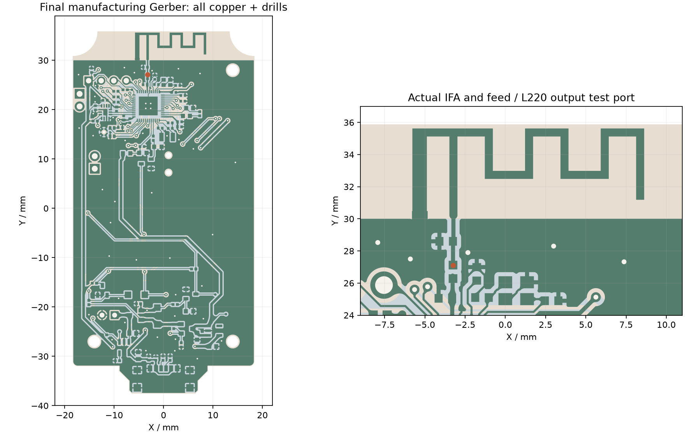
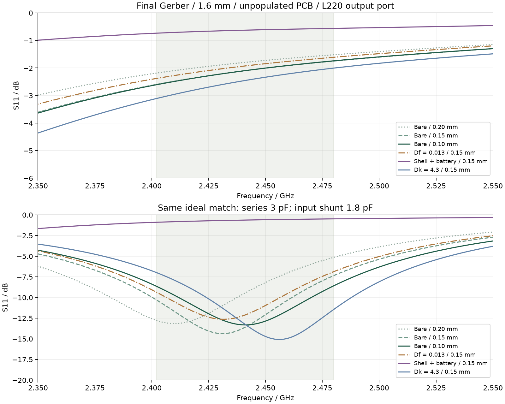

# 最终 Gerber · 1.6 mm PCB 天线计算

**2026-09-28 整理完成。** 已按用户提供的 `Gerber_nRF52832遥控器_2026-09-24.zip` 重建电磁几何，完成六组 openEMS 仿真。本文替代此前基于 PCB 快照的报告；旧的 `42.1 + j47.4 Ω` 裸板结果及其匹配候选不再作为当前版本的依据。

> 初步结论：当前模型的天线馈点偏感性，装壳和电池影响明显。计算可以提供调试起点，但尚不足以确定最终匹配 BOM。以下均为仿真结果，非样机实测。

## 简报

| 条件 | 2.441 GHz 输入阻抗 | BLE 频段最差未匹配 S11 |
|---|---:|---:|
| 裸板，最细 0.10 mm 射频 XY 网格 | **11.10 + j45.44 Ω** | **−1.74 dB** |
| 裸板，0.15 mm 网格（装壳组对照） | 11.72 + j48.07 Ω | −1.75 dB |
| 装壳 + 浮置电池包络，0.15 mm 网格 | **12.05 + j118.82 Ω** | **−0.56 dB** |

频段为 **2.402–2.480 GHz**，阻抗参考面位于 **L220 天线侧焊盘 `$1N324`**。正虚部表示感性。这里测的是该焊盘看向馈线与天线的输入阻抗，不是 nRF52832 ANT 引脚阻抗，也不是完整装配电路的输入阻抗。

有限取值的理想两元件匹配扫描得到：裸板可用**输入侧并联 1.8 pF + 串联 3.0 pF**作为计算候选，频段最差 S11 约 **−8.58 dB**；装壳假设下另行扫描的候选为**输入侧并联 1.5 pF + 串联 0.7 pF**，约 **−6.55 dB**。这两组在本次扫描中均未覆盖全频段 −10 dB 目标，不能据此宣称天线已经调好，也不代表所有网络都无法达到目标。

## 立创 FR-4 参数依据

- [立创官方 PCB 能力表](https://jlcpcb.com/capabilities/pcb-capabilities)给出的双层 FR-4 介电常数为 **Dk = 4.5**，此项没有标明频率。本轮采用它作为名义基准。
- [立创官方 FR-4 页面](https://jlcpcb.com/pcb-fabrication/fr4-pcb)给出典型 **Df ≈ 0.02（1 MHz）**。它不是本订单在 2.4 GHz 的已知实测值；本轮仅用作基准假设。
- [建滔 KB-6160 官方材料表](https://www.kblaminates.com/upload/ueditor/20220525/KB-6160-0831.pdf)中，59 mil / 7628×8 一行在 2 GHz 给出 Dk = 4.5、Df = 0.013，Dk 公差 ±0.2。本轮增加 **Df = 0.013** 和 **Dk = 4.3** 两组独立敏感性计算；这不表示已确认订单使用 KB-6160，也不是该订单的公差承诺。

板厚采用用户确认的 **1.6 mm**。Gerber 本身不包含板材牌号和介电参数。源网页查阅日期为 2026-09-24；[参数记录与来源校验值](https://github.com/GuruGuru-SEU/nrf-canon-remote/blob/main/reference/rf/materials-20260924.json)可供追溯。

## 实际建模内容

本次直接解析最终制造文件中的两面全部铜、板框、101 个 PTH 和 6 个 NPTH。`Drill_PTH_Through_Via.DRL` 的过孔已包含在总 PTH 文件内，没有重复建模。飞针数据用于识别 L220 馈点；Gerber 铜几何已核对天线馈点、IFA 短路端以及 L220 两焊盘的分离关系。

天线直接来自最终底层 Gerber，没有用旧封装拼接。天线顶部区域与前一版快照基本一致；但本次纳入全部网络铜、完整钻孔和新的材料参数，因此两版模型不等价，不能把全部阻抗差异归因于 Dk 的变化。



图中底层铜为深绿、顶层铜为灰蓝，橙点为仿真端口。左图全板，右图放大天线区域。

- 铜采用 PEC 薄片；板厚换算为 **1.545 mm 铜面间距**，扣除名义铜厚及阻焊余量。这是近似叠层，不是板厂确认的实际叠层。
- PTH 采用孔半径 + 25 µm 的实心导体近似，不是空心孔壁模型。阻焊开窗已提取供核查，阻焊介质未纳入求解。
- 50 Ω 集总端口沿板厚连接底面 RF 焊盘与正对的顶面地铜，未做实际同轴探针和测试夹具去嵌。
- 器件不装配；C216、L220、C217 数值和芯片阻抗未嵌入模型。其他网络保留铜，但没有器件负载；这与完整 PCBA 有区别。
- 装壳组使用 v0.12 上下盖 STL，假设壳体 εr = 2.8、tanδ = 0.01，并加入机械布局对应的浮置导体电池包络。电池引线、USB 金属壳、按键、螺钉和人体均未包含。
- FR-4 损耗通过 2.45 GHz 处的等效电导率实现，在该频率对应所设 Df；没有模拟完整的材料频散。

## 六组结果与数值检查

| 计算组 | 射频 XY 网格 | Dk / Df | 2.441 GHz 阻抗 | 频段最差 S11 |
|---|---:|---:|---:|---:|
| 裸板基准 `gerber-bare` | 0.20 mm | 4.5 / 0.020 | 11.14 + j53.32 Ω | −1.52 dB |
| 裸板细化 `gerber-fine` | 0.15 mm | 4.5 / 0.020 | 11.72 + j48.07 Ω | −1.75 dB |
| 裸板再细化 `gerber-finer` | 0.10 mm | 4.5 / 0.020 | 11.10 + j45.44 Ω | −1.74 dB |
| 较低损耗 `gerber-low-loss` | 0.15 mm | 4.5 / 0.013 | 10.73 + j48.02 Ω | −1.61 dB |
| 较低介电常数 `gerber-dk43` | 0.15 mm | 4.3 / 0.020 | 12.05 + j41.64 Ω | −2.00 dB |
| 壳体与电池 `gerber-housed` | 0.15 mm | 4.5 / 0.020 | 12.05 + j118.82 Ω | −0.56 dB |

六组均达到 **−40 dB 时域能量停止阈值**。已经检查端口数据有限、实部为正，并核对阻抗换算 S11 与导出的 Touchstone 一致。这是基本数值检查，不等于与实物一致。

裸板射频区 XY 网格从 0.20 → 0.15 mm 时，中心频率阻抗变化 **10.68%**；0.15 → 0.10 mm 时仍变化 **5.77%**，频段内最大阻抗差 **3.28 Ω**。板厚方向保持 5 个单元，外围网格较粗，装壳组未继续细化。最细组还有 19 条未被网格使用的图元警告，涉及小铜片、空隙和部分孔柱。**因此不能声称严格网格收敛，也不应把上述小数位理解为实际精度。**

## 匹配候选怎么理解

下图仅表示在该参考面前接入理想网络后的电路关系，不是现有 PCB 的元件位号替换图：

```text
理想 50 Ω 输入 ──●──── Cs ──── 原始 Gerber 负载
                 │               ↑ L220 天线侧参考面
                 Cp
                 │
                GND
```

| 针对条件 | 输入侧并联 Cp | 串联 Cs | 匹配后频段最差 S11 |
|---|---:|---:|---:|
| 裸板，0.10 mm 网格 | 1.8 pF | 3.0 pF | −8.58 dB |
| 装壳假设，0.15 mm 网格 | 1.5 pF | 0.7 pF | −6.55 dB |

将同一组裸板候选用于 0.15 mm 裸板时，最差 S11 为 −7.34 dB；用于装壳组仅为 **−0.47 dB**。这说明当前误差和装配环境足以改变匹配值。0.15 mm 与 0.10 mm 两组裸板各自扫描得到的串联电容也分别为 2.7 pF 和 3.0 pF。

扫描同时考虑输入侧、负载侧并联的两种 L 网络，候选包含电容 0.2–10 pF、电感 0.5–22 nH 中的离散值及开路 / 短路；目标是降低 BLE 频段最差 S11。元件为理想集中参数，未计入 Q、ESR、SRF、焊盘和走线寄生。上述数值不能直接替换现有 L220 / C216 / C217，也不取代芯片端的 Nordic 参考网络。



上图为各条件原始 S11，下图统一使用裸板候选 Cp = 1.8 pF、Cs = 3.0 pF，绿色阴影表示 BLE 频段。下图没有对各曲线单独重新优化。

**建议下一步：** 保留天线端调试焊盘，先确认实际板材及叠层，再用最终电池与外壳装配样机，在一致的参考面通过 VNA 测量后选定元件。当前结果支持“需要调谐且装壳影响大”这一判断；本次没有计算辐射效率或遥控距离。

## 下载与复算

- [0.10 mm 裸板 S1P](gerber-finer.s1p) · [CSV](gerber-finer.csv) · [参数](gerber-finer.json)
- [0.15 mm 裸板 S1P](gerber-fine.s1p) · [CSV](gerber-fine.csv) · [参数](gerber-fine.json)
- [0.20 mm 裸板 S1P](gerber-bare.s1p) · [CSV](gerber-bare.csv) · [参数](gerber-bare.json)
- [装壳与电池 S1P](gerber-housed.s1p) · [CSV](gerber-housed.csv) · [参数](gerber-housed.json)
- [Df = 0.013 对照 S1P](gerber-low-loss.s1p) · [CSV](gerber-low-loss.csv) · [参数](gerber-low-loss.json)
- [Dk = 4.3 对照 S1P](gerber-dk43.s1p) · [CSV](gerber-dk43.csv) · [参数](gerber-dk43.json)
- [匹配扫描与数值检查](gerber-matching.json) · [Gerber 几何核查](gerber-audit.json)
- [六组求解日志、端口时域数据与参数 ZIP](gerber-solver-evidence.zip)
- [提取的制造几何](https://github.com/GuruGuru-SEU/nrf-canon-remote/blob/main/reference/rf/gerber-20260924.json) · [复算步骤与脚本](https://github.com/GuruGuru-SEU/nrf-canon-remote/tree/main/scripts/rf)
- [机械 3D 预览](../preview.html?rev=0.12) · [装配 3MF](../models/remote_assembly.3mf)

原始 ZIP 的 SHA-256：`3fc97f87b7eec812915d751c0682821ee30cdcd28201358806b40dc6174ed5ac`。源文件导出时间为 2026-09-24 14:07:48。本轮没有修改用户 PCB Layout。旧计算文件保留供历史比较，均不代表本次最终 Gerber 结果。
