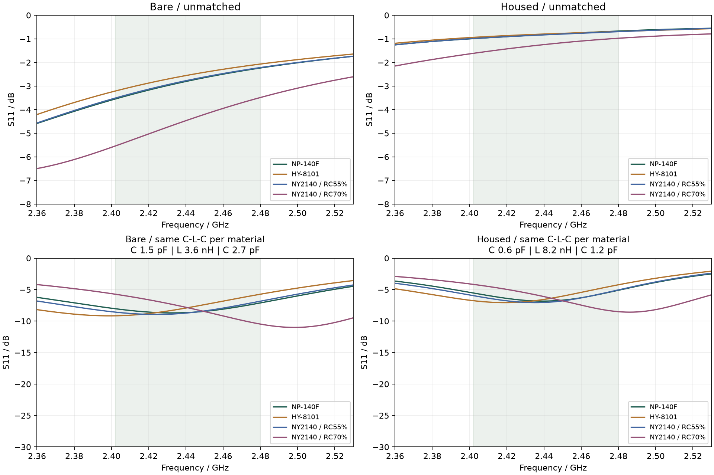
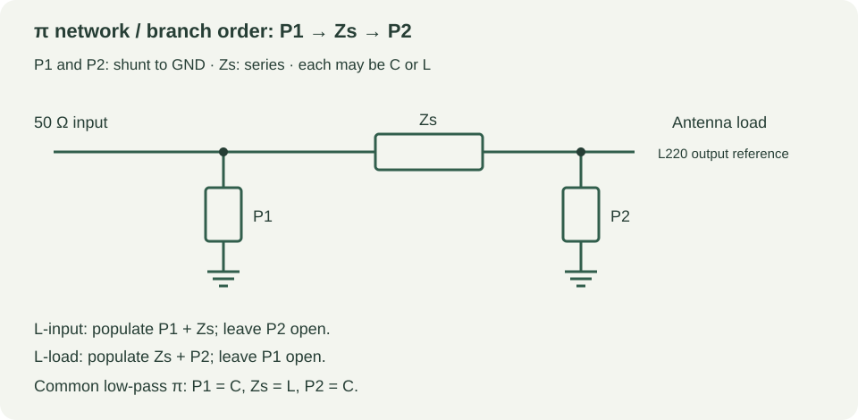

# 三种 JLC 板材 · 最终 Gerber 天线计算

**2026-09-28。** 本报告使用用户提供的三份 JLC 材料 PDF 和最终 Gerber，按材料分别建立 2.4 GHz 开放边界模型。NY2140 的 PDF 是 MSDS，不含 Dk/Df，因此额外引用制造商官方 1 GHz 表格，并按两种树脂含量分别计算。三份 PDF 对应四个条件工况。

> 结论先说：板材变化会改变天线输入阻抗，装入外壳后变化更大。匹配网络必须保留调试位；下面的 L/π 扫描是理想元件的起始候选，不是最终 BOM。

## 材料参数与来源

| 材料 | 本次仿真参数 | 处理状态 | PDF / 来源 |
|---|---|---|---|
| 上海南亚 NY2140 | RC55: Dk 4.15 / Df 0.0166；RC70: Dk 3.70 / Df 0.0178 | 1 GHz 两种树脂含量条件值 | [NY2140-MSDS.pdf](https://github.com/GuruGuru-SEU/nrf-canon-remote/blob/main/reference/rf/materials/NY2140-MSDS.pdf) |
| 台湾南亚 NP-140F | Dk 4.10 / Df 0.0130 | 1 GHz 典型范围中点 | [NP-140F.pdf](https://github.com/GuruGuru-SEU/nrf-canon-remote/blob/main/reference/rf/materials/NP-140F.pdf) |
| 航宇 HY-8101 | Dk 4.30 / Df 0.0220 | 表中典型值，频率未明确 | [HY-8101.pdf](https://github.com/GuruGuru-SEU/nrf-canon-remote/blob/main/reference/rf/materials/HY-8101.pdf) |

- **NP-140F**：PDF 第 1 页给出 1 GHz 典型 Dk 4.0–4.2、Df 0.012–0.014；本次取中点 Dk 4.10 / Df 0.0130，并保持到 2.4 GHz。这是频率外推，不是厂家 2.4 GHz 实测值。
- **HY-8101**：PDF 第 1 页给出典型 Dk 4.3、Df 0.022，但没有明确测试频率；第 2 页曲线只覆盖低频范围。本次按 Dk 4.30 / Df 0.0220 作为 2.4 GHz 近似。
- **NY2140**：用户 PDF 只有 MSDS；制造商 [NY2140/NY2140P 官方表格](https://www.nouyatec.com/product/base-material/lead-free-compatible/12)在 1 GHz 给出 R/C 55% 为 Dk 4.15 / Df 0.0166、R/C 70% 为 Dk 3.70 / Df 0.0178。本次把两种构造都算了；实际 JLC 订单的玻纤布、树脂含量和叠层仍需向板厂确认。

Dk 在模型中不随频率变化；损耗按 2.45 GHz 的 `σ = 2πf ε0 Dk·Df` 转成固定电导率输入 openEMS，因此等效 Df 在扫频中按 1/f 变化，BLE 频段内相对所填 Df 约偏差 −1.2% 到 +2.0%。这不是材料真实频散模型。Gerber 不包含板材牌号和频散数据。三份原始 PDF 已保存到仓库的 `reference/rf/materials/`。

## 仿真设置

- 几何：最终 Gerber `Gerber_nRF52832遥控器_2026-09-24.zip` 提取的全板双面铜、板框、PTH/NPTH；天线和馈线来自最终铜层。
- 板厚：用户确认 **1.6 mm**；铜面中心近似间距 1.545 mm。射频区域 XY 网格 0.10 mm，频率 2.2–2.7 GHz，重点观察 2.402–2.480 GHz BLE 频段。
- 参考面：L220 天线侧焊盘，50 Ω 集总端口；不是 nRF52832 的 ANT 引脚。
- `bare` 为裸板，`housed` 加入当前外壳 STL（假设 εr 2.8、tanδ 0.01）和软包电池金属包络。按键、USB-C、螺钉、人体及完整器件寄生未加入。
- 每个工况都实际执行 openEMS 时域求解，并检查 `-40 dB` 能量停止、端口数据有限、阻抗实部为正，以及 S1P 与 CSV 一致。

## 裸板结果

| 材料工况 | 2.441 GHz 输入阻抗 | 未匹配频段最差 S11 | 该工况 C-L-C π 候选（P1 / Zs / P2） | 匹配后最差 S11 |
|---|---:|---:|---|---:|
| NP-140F | 11.52 + j32.81 Ω | -2.24 dB | C 1.1 pF / L 4.3 nH / C 2.7 pF | -8.77 dB |
| HY-8101 | 11.94 + j39.40 Ω | -2.07 dB | C 0.6 pF / L 5.1 nH / C 2.2 pF | -9.03 dB |
| NY2140 / RC55% | 11.77 + j34.52 Ω | -2.22 dB | C 1.3 pF / L 4.3 nH / C 2.7 pF | -9.13 dB |
| NY2140 / RC70% | 14.36 + j18.52 Ω | -3.49 dB | C 3 pF / L 2.2 nH / C 5.1 pF | -11.10 dB |

## 装壳结果

| 材料工况 | 2.441 GHz 输入阻抗 | 未匹配频段最差 S11 | 该工况 C-L-C π 候选（P1 / Zs / P2） | 匹配后最差 S11 |
|---|---:|---:|---|---:|
| NP-140F | 10.30 + j91.41 Ω | -0.67 dB | C 0.3 pF / L 10 nH / C 1.1 pF | -6.06 dB |
| HY-8101 | 11.38 + j99.25 Ω | -0.69 dB | C 0.4 pF / L 12 nH / C 1 pF | -6.46 dB |
| NY2140 / RC55% | 10.81 + j93.47 Ω | -0.70 dB | C 0.5 pF / L 10 nH / C 1.1 pF | -6.19 dB |
| NY2140 / RC70% | 11.88 + j75.89 Ω | -0.98 dB | C 0.4 pF / L 8.2 nH / C 1.3 pF | -7.35 dB |

## 为什么专家说要看 L 型 / π 型

专家提醒补齐 **L 型 / π 型** 比较是有必要的。此前扫描也包含电感，但汇报只展示了选出的电容-电容候选，缺少含电感方案的对照；本次补齐了 LC 两元件和 π 三元件的各类组合。这里的 **L 型** 指一个串联支路加一个并联支路的拓扑：对本来呈感性的复数负载，两个电容也可能完成阻抗变换，但不能据此排除其他 LC 组合。

**π 型**有三个支路：输入侧并联 P1、串联 Zs、天线侧并联 P2。常见的低通形式是 **C-L-C**，但实际仍应由 VNA 和器件寄生决定。分支方向和元件位置见 [matching-topologies.svg](matching-topologies.svg)。

下表同时给出每种工况的含 L、C 两元件候选；`open` 表示该并联支路不装。以上和以下的“最佳”都只针对列明的有限离散值扫描，不代表全局最优。

| 材料 / 装配条件 | L 型候选（P1 / Zs / P2） | 匹配后频段最差 S11 |
|---|---|---:|
| NP-140F / 裸板 | open / L 2.7 nH / C 2.2 pF | -8.63 dB |
| NP-140F / 装壳 | open / L 9.1 nH / C 1.1 pF | -5.94 dB |
| HY-8101 / 裸板 | open / L 3.3 nH / C 2 pF | -8.81 dB |
| HY-8101 / 装壳 | open / L 10 nH / C 1 pF | -5.58 dB |
| NY2140 / RC55% / 裸板 | open / L 3 nH / C 2.2 pF | -9.04 dB |
| NY2140 / RC55% / 装壳 | open / L 8.2 nH / C 1.1 pF | -5.70 dB |
| NY2140 / RC70% / 裸板 | L 2.4 nH / C 1.5 pF / open | -9.09 dB |
| NY2140 / RC70% / 装壳 | open / L 6.8 nH / C 1.3 pF | -6.65 dB |

### 裸板共同候选

跨四个材料工况共同扫描的 **C-L-C π 网络**为 `C 1.5 pF / L 3.6 nH / C 2.7 pF`，最差频段 S11 为 **-5.72 dB**；同一拓扑在示例元件扰动中为 **-4.75 dB**（C：±max(5%, 0.05 pF)，L：±5%，27 种组合）。作为对照，包含电感的最佳混合 π 网络为 `C 1.5 pF / L 3.6 nH / C 2.7 pF`（-5.72 dB），包含电感的最佳 L 网络为 `open / L 1.8 nH / C 1.8 pF`（-5.43 dB）。

### 装壳共同候选

跨四个材料工况共同扫描的 **C-L-C π 网络**为 `C 0.6 pF / L 8.2 nH / C 1.2 pF`，最差频段 S11 为 **-4.16 dB**；同一拓扑在示例元件扰动中为 **-2.67 dB**（C：±max(5%, 0.05 pF)，L：±5%，27 种组合）。作为对照，包含电感的最佳混合 π 网络为 `C 1.8 pF / C 1.3 pF / L 27 nH`（-4.27 dB），包含电感的最佳 L 网络为 `L 6.8 nH / C 0.6 pF / open`（-3.83 dB）。

这些匹配值是在 0.2–22 pF、0.5–47 nH 离散理想元件网格上，以 2.402–2.480 GHz 的最差反射为目标扫描得到的。没有计入 Q、ESR、SRF、焊盘和走线寄生，因此不能直接把它们替换成 L220/C216/C217 的生产值。建议 PCB 保留 π 网络三个 0402 调试位，并在裸板和最终装配两种状态下以同一参考面用 VNA 复测。

## 限制与建议

1. 三份资料没有同时提供经过确认的 2.4 GHz、1.6 mm 成品叠层参数；因此材料之间的排序可以参考，绝对阻抗不能当成实测值。
2. NY2140 的 RC55/RC70 是制造商示例构造，不是本订单的保证上下界。拿到 JLC 实际 stackup 后，应以板厂叠层和玻纤布含量重算。
3. 外壳组只近似了壳体和电池，USB-C 外壳、按键、螺钉、焊盘寄生和人体耦合仍会改变匹配。
4. 先前 Dk=4.5 裸板模型在 0.15→0.10 mm 网格细化时，中心阻抗仍变化约 5.77%；本轮统一使用 0.10 mm，但没有完成每种材料的独立网格收敛，也没有装壳组的收敛研究。过孔为实心金属柱近似、PEC 铜面不计铜损、阻焊介质未建模。日志中未被网格使用的小图元仍是误差来源。
5. 在真实样机上先测裸板，再测最终外壳/电池装配；按 VNA 的频点和参考面调整 π 网络，最后再确认射频输出和 BLE 灵敏度。共同候选只优化了本次四个条件点，不能保证所有材料公差与批次都覆盖；本轮也没有计算辐射效率或通信距离。

## 数值检查

| 求解 | 停止时步数 | 停止能量 | 未使用图元警告数 |
|---|---:|---:|---:|
| np140f-bare | 44220 | -41.24 dB | 19 |
| np140f-housed | 58800 | -40.01 dB | 19 |
| hy8101-bare | 41808 | -41.30 dB | 19 |
| hy8101-housed | 48020 | -40.20 dB | 19 |
| ny2140-rc55-bare | 42880 | -40.98 dB | 19 |
| ny2140-rc55-housed | 53410 | -40.43 dB | 19 |
| ny2140-rc70-bare | 42880 | -40.47 dB | 19 |
| ny2140-rc70-housed | 49980 | -40.61 dB | 19 |

每组时域求解与阻抗换算已校验；匹配公式通过独立 ABCD 矩阵级联和已知阻抗变换核对。时域停止判据不等于空间网格收敛，也不等于实物验证。

## 下载与复算

- [材料对比与匹配数据 JSON](materials-matching.json)
- [材料对比图](materials-comparison.png) · [π/L 网络拓扑图](matching-topologies.svg)
- [八组 openEMS 求解证据](materials-solver-evidence.zip)
- [复算脚本](https://github.com/GuruGuru-SEU/nrf-canon-remote/tree/main/scripts/rf)：`simulate.py`、`match_networks.py`、`analyze_materials.py`

原始 Gerber SHA-256：`3fc97f87b7eec812915d751c0682821ee30cdcd28201358806b40dc6174ed5ac`。本次没有修改用户 PCB Layout。
